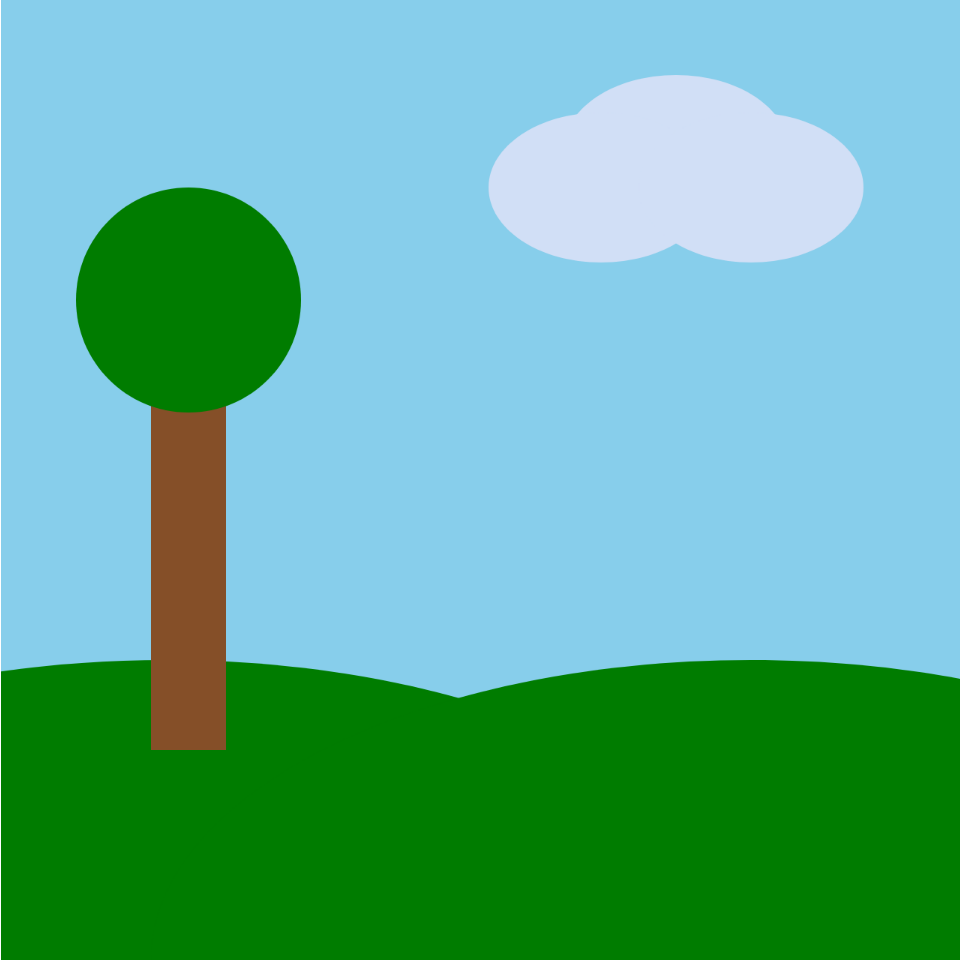

# Landscape Challenge

Emmett Walthers

[View this project online](https://emmettwalthers.github.io/cart253/Topics/instructions/landscape-challenge/)

## Description

> This project contains an amazing landscape with a tree, clouds, and hills created using draw functions!

## Screenshot(s)

> 

## Attribution

> - This project uses [p5.js](https://p5js.org).

## License

> This project is licensed under a Creative Commons Attribution ([CC BY 4.0](https://creativecommons.org/licenses/by/4.0/deed.en)) license with the exception of libraries and other components with their own licenses.