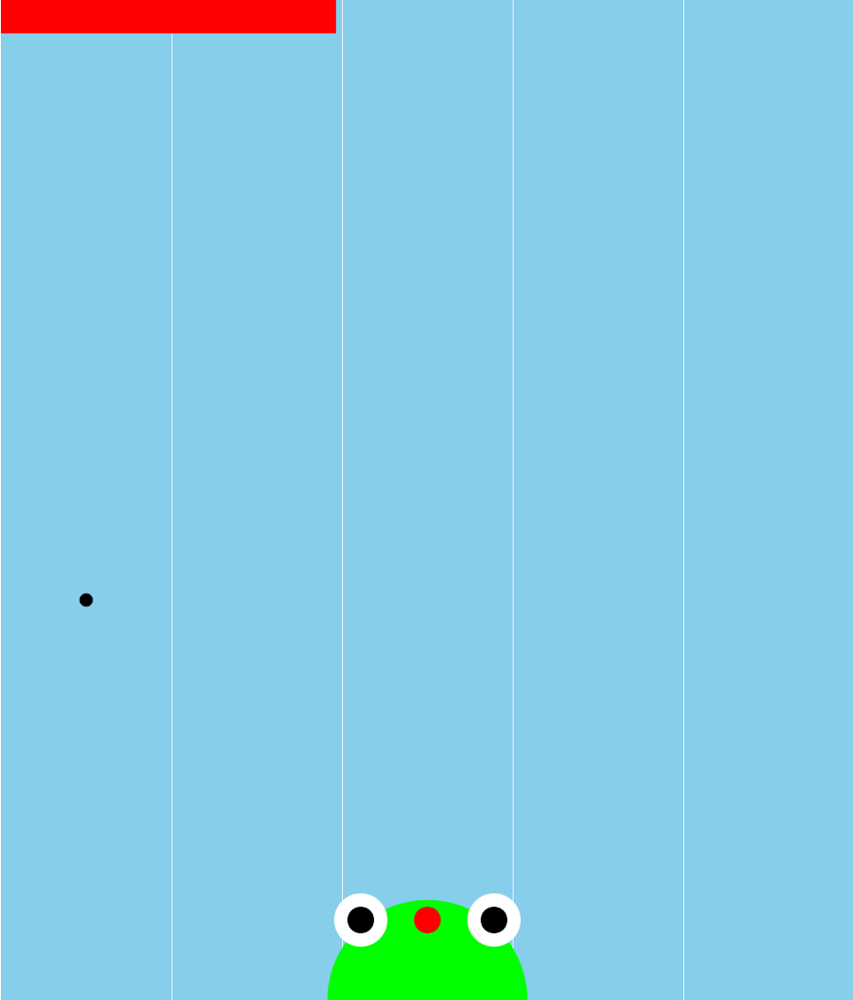

# Frog Dude (The Game)

Emmett Walthers

[View this project online](https://emmettwalthers.github.io/cart253/Topics/mod-jam/)

## Description

> The project is a game about a frog which needs to eat flies to survive

> Start the Game by clicking on the frog, use arrow keys to control it, avoid the blue flies!

> Don't let the hunger bar run out or you'll lose, if you fill it fully, you win!

> Includes awesome music and sound effects

## Instructions Followed

> "A title and instructions screen." - Cool Title Animation and Transition

> "An ending." - If hunger bar gets too low, "Game Over" if it gets filled fully, "You Win"

> "A scoring system." - Hunger bar at top of screen

> "New kinds of fly movement." - Lane system, where the fly picks a random one to come down

> "New visual and/or audio effects." Lots of sound effects, background music, and some cool visuals with the title screen

> "Add at least two other features to the experience." Use arrow keys to move between lanes. Added bad fly (blue one) which harms the player. Hunger bar system.

## Screenshot(s)

> 

> 

## Attribution

> - This project uses [p5.js](https://p5js.org).
> - The sound effects are provided by https://getsoundly.com/
> - Music from #Uppbeat (free for Creators!): https://uppbeat.io/t/pecan-pie/boogie

## License

> This project is licensed under a Creative Commons Attribution ([CC BY 4.0](https://creativecommons.org/licenses/by/4.0/deed.en)) license with the exception of libraries and other components with their own licenses.
