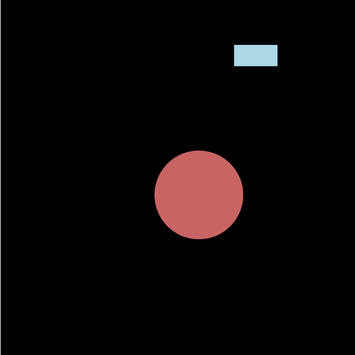

# Mr. Furious

Emmett Walthers

[View this project online](https://emmettwalthers.github.io/cart253/Topics/variables/variables-challenge/)

## Description

This description should help the reader understand what the program is, anything they should know to be able to experience it (controls, special features, etc.), and what the desired user experience is. For example:

> This Project showcases the wonderful Mr. Furious who gets more red and shakier as time goes on... oh and there's a bird.

## Screenshot

> 

## Attribution

> - This project uses [p5.js](https://p5js.org).

## License

> This project is licensed under a Creative Commons Attribution ([CC BY 4.0](https://creativecommons.org/licenses/by/4.0/deed.en)) license with the exception of libraries and other components with their own licenses.
