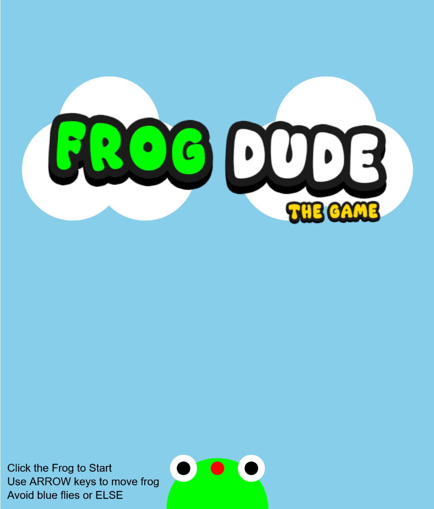

# Frog Dudes (The Games)

Emmett Walthers

[View this project online](https://emmettwalthers.github.io/cart253/Topics/variations-jam/)

## Frog Game [OG] Description

> The project is a game about a frog which needs to eat flies to survive

> Start the Game by clicking on the frog, use arrow keys to control it, avoid the blue flies!

> Don't let the hunger bar run out or you'll lose, if you fill it fully, you win!

> Includes awesome music and sound effects

## Fly Game [Variation 1] Description

> The project is a game about a fly which needs to avoid the frog to survive

> You have 15 flies (chances) to get 10 past the frog - or else you lose...

> Use the arrow keys to control the fly

> Includes awesome music and sound effects

## Frog Game 2 [Variation 2] Description

> The frog is full now, you must avoid the falling flies. Try to get a highscore!

> The frog has a certain amount of health, eat enough flies and you lose

> Use the arrow keys to control the frog

> Includes awesome music and sound effects

## Frog Game Lite [Variation 3] Description

> The frog is now mini!

> Use your cursor to move the frog around and catch the flies.

> Be careful of blue flies because their back and they hit HARD now

> still Includes awesome music and sound effects

## Screenshot(s)

> 

> 

## Attribution

> - This project uses [p5.js](https://p5js.org).
> - The sound effects are provided by https://getsoundly.com/
> - Music from #Uppbeat (free for Creators!): https://uppbeat.io/t/pecan-pie/boogie

## License

> This project is licensed under a Creative Commons Attribution ([CC BY 4.0](https://creativecommons.org/licenses/by/4.0/deed.en)) license with the exception of libraries and other components with their own licenses.
